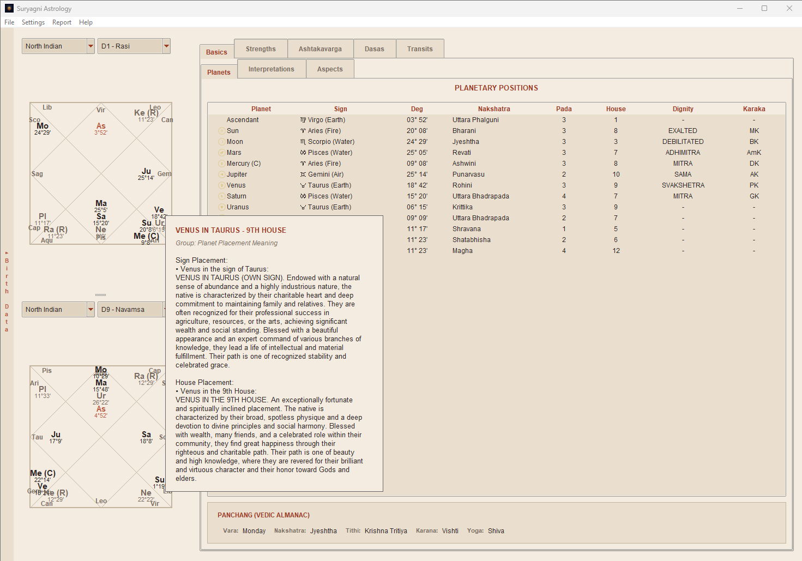
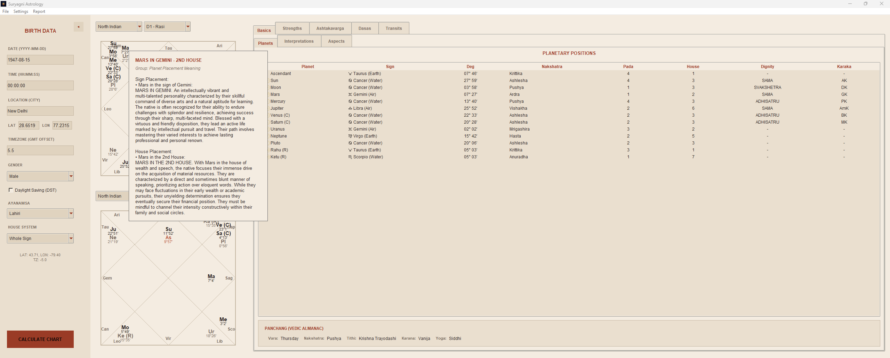
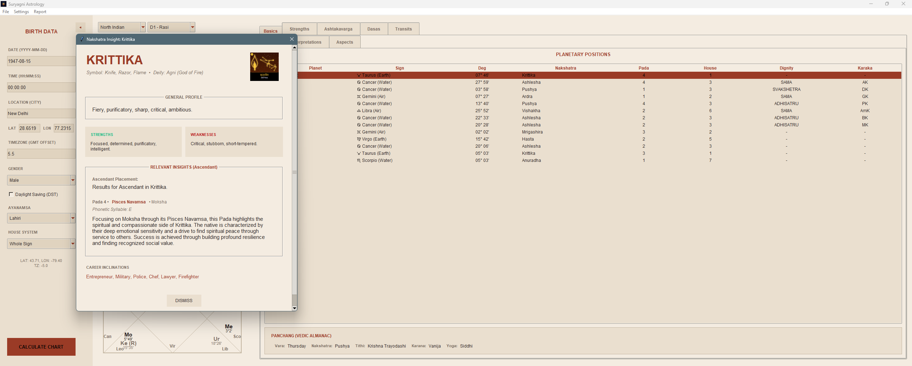
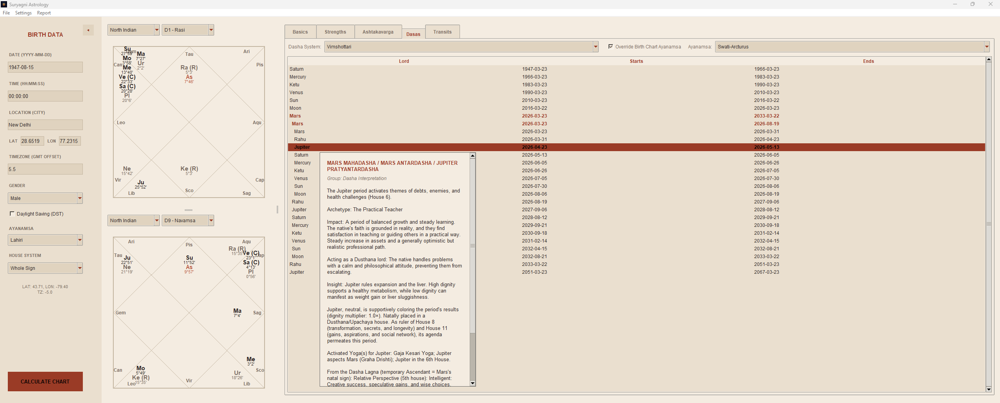
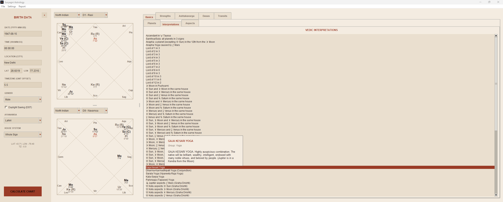
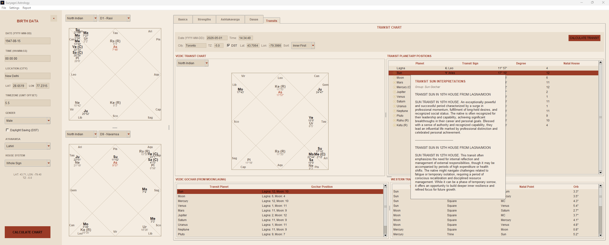
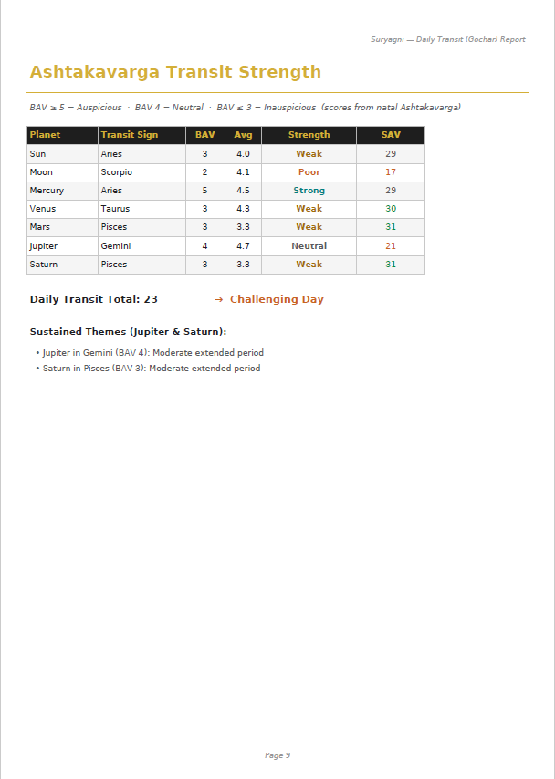
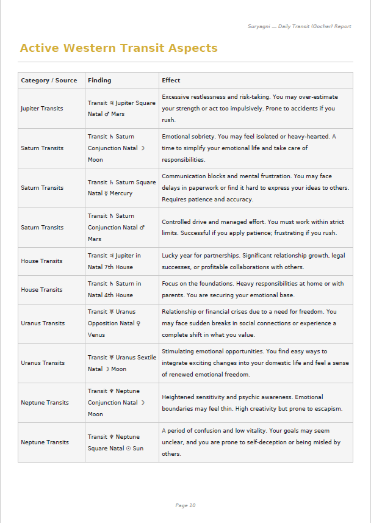
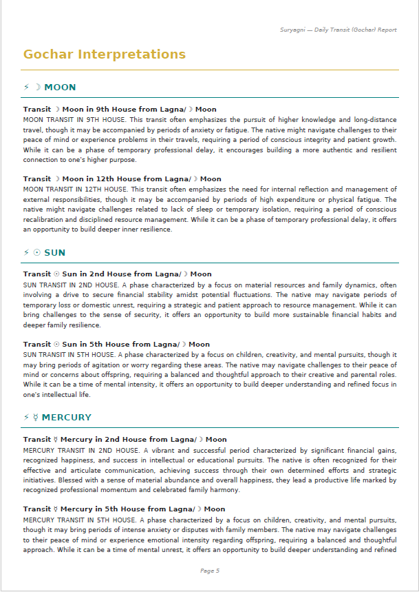
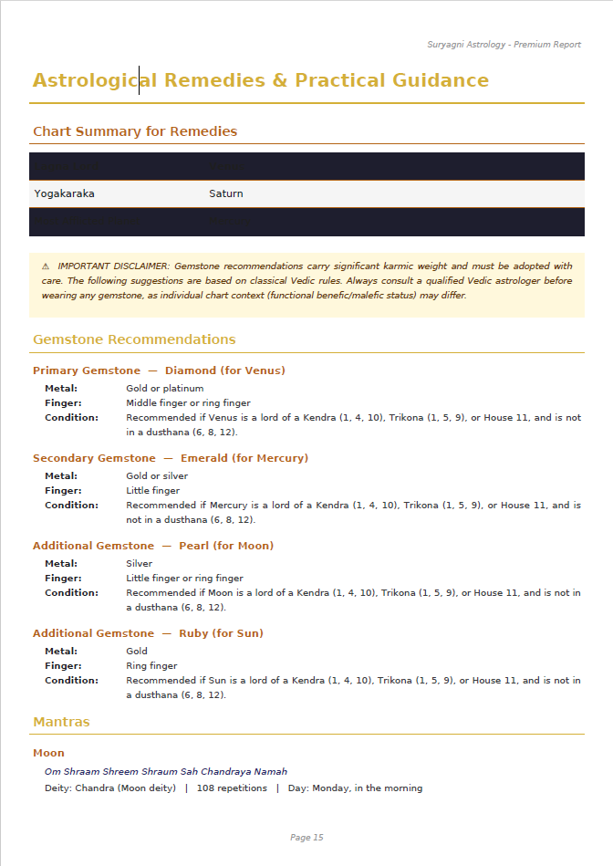

# 🌞 Suryagni: Free Vedic Astrology/Jyotish Software

**Discover the depths of your destiny with precision and elegance.**

Suryagni is a beautiful, locally-hosted desktop application for Windows that brings ancient Vedic astrological wisdom into the modern era. Designed with deep, immersive themes and exact astronomical calculations, it is the perfect tool for both beginners and experienced astrologers.

> **Microsoft Store:** [Get Suryagni Free](https://apps.microsoft.com/detail/9NJ9KPKX8TBS) with an optional one-time in-app purchase for generating reports.

---

## ✨ Features

*   **Aesthetic Experience:** Immerse yourself in our custom UI, featuring elegant "Cosmic Copper" and "Ancient Manuscript" themes that make reading your chart a spiritual experience.
*   **Precision Calculations:** Input your exact birth date, time, and location for highly accurate planetary positions.
*   **100% Private & Local:** Your sensitive birth data never leaves your computer. All charts and calculations are processed locally on your machine. 
*   **Premium PDF Reports:** Generate beautiful, printable "Tala Patra" styled reports that you can keep forever. Get the whole picture at once. Export all your scattered data into a single, easy-to-read consolidated REPORT. Upgrade to unlock unlimited, beautifully formatted reports for all your saved charts.

---

## 🔓 Choose Your Path

Suryagni is completely free to download and use for basic chart casting. A one-time premium in-app purchase is available for generating reports.

> **Recommended next step:** [Open the Microsoft Store listing](https://apps.microsoft.com/detail/9NJ9KPKX8TBS) to get the free app and optional report-generation upgrade.

### Free Tier
*   Calculate accurate birth charts.
*   View planetary positions and basic planetary states.
*   Clean, ad-free UI experience.

**Screenshots**

| | | |
|---|---|---|
|  |  |  |
|  |  |  |

### Premium Unlock (One-Time Purchase)
*   **Available on the Microsoft Store:** [Unlock report generation with a one-time in-app purchase](https://apps.microsoft.com/detail/9NJ9KPKX8TBS).
*   Generate beautiful, multi-page PDF reports for your charts.

**Premium Screenshots**

| | |
|---|---|
|  |  |
|  |  |

---

## 🔒 Privacy & Support

We believe your astrological data is deeply personal. Suryagni does not use background trackers, and it does not upload your birth details to the cloud.

*   [Read our full Privacy Policy](./privacy-policy.md)

---
*Built for Windows 10 & 11.*
